Cette page a pour but d'expliquer les principaux composants utilisés dans l'électronique et leurs principales applications, notamment dans les circuits. 

# Les résistances

Résistances fixes: Elles ont toujours la même valeur. 

Sa valeur ou unité est l'ohm et sa valeur théorique est déterminée par un code de couleur. 

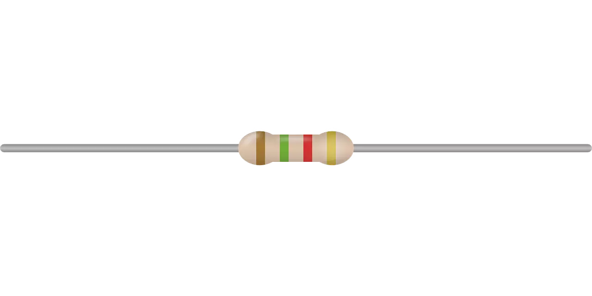

Selon [la loi d'ohm](../Electronique/loi_ohm.md), plus la résistance est grand, plus l'intensité est faible, c'est pourquoi elles sont utilisées pour limiter ou empêcher le passage du courant à travers une zone d'un circuit.

Le symbole utilisé pour les circuits, dans ce cas, il en existe deux, sont les suivants:

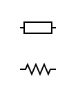

Le deuxième symbole est surtout utilisé aux U.S.

Sur les résistances, on retrouve des barres colorées (code couleur) qui servent à définir la valeur de la résistance en ohms.

La première couleur indique le premier nombre de la valeur de résistance, la deuxième couleur du deuxième nombre, et le troisième le nombre de zéros à ajouter (le multiplicateur). 

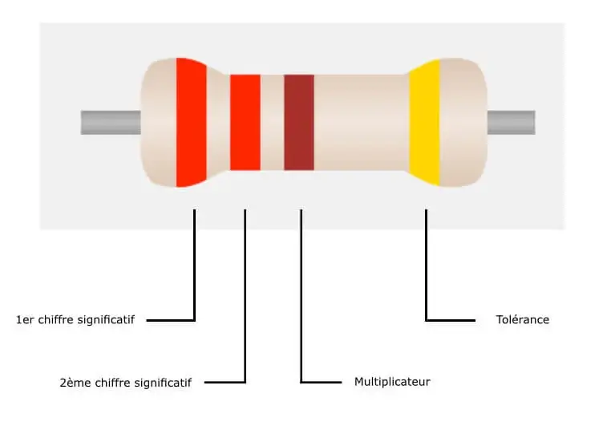

Chaque couleur a une valeur

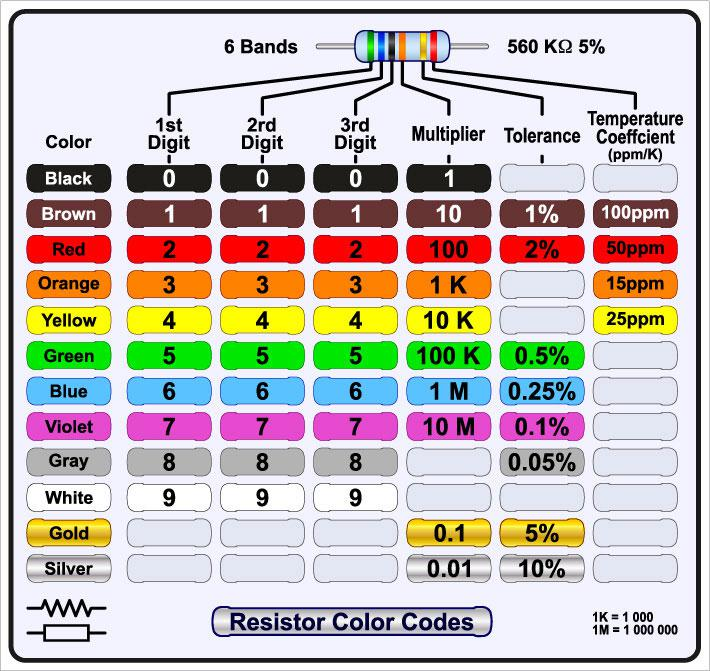

Exemple de calcul:

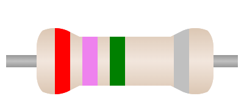

La première couleur nous indique qu'elle a une valeur de 2, la deuxième de 7 et la troisième valeur est pour 100 000 (ou ajouter 5 zéros). La résistance vaut donc 2 700 000 ohms. 

Plus d'infos sur les résistances ici: [Les résistances](../Electronique/resistances.md)

# Potentiomètre ou résistance variable

Un potentiomètre s'agit d'une résistance mécaniquement variable (manuellement). Appelé aussi "Résistance variable", et parfois Rhéostat. Le potentiomètre peut être considéré comme une résistance dont on peut faire varier la valeur ohmique entre deux points, par simple action mécanique sur un axe rotatif ou rectiligne. Il est constitué d'une piste résistive sur laquelle entre en contact un curseur mobile, qui peut se promener d'une extrémité à l'autre de la piste. 

Les valeurs de la résistance du potentiomètre variant de 0Ω la valeur minimale à un maximum dépendant du potentiomètre.

Les potentiomètres ont 3 bornes. La connexion des bornes extérieures (les extrémités) le fait fonctionner comme une résistance fixe avec une valeur égale au maximum que le potentiomètre peut atteindre.

Le terminal du milieu avec celui d'une extrémité le fait fonctionner comme variable lors de la rotation d'une petite roulette.

Voici 2 types différents, mais ils fonctionnent de la même manière: 

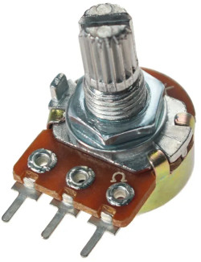 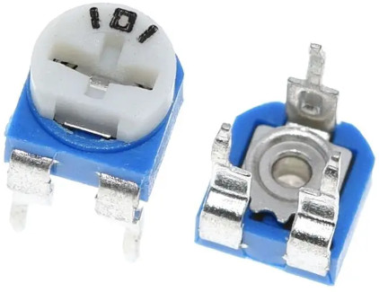

Tout symbole électronique qui est croisé par une flèche signifie qu'il est variable.

Voici les symboles pour un potentiomètre:

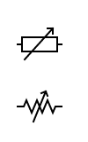

Plus d'infos sur les potentiomètres ici: [Les potentiomètres](../Electronique/potentiomètre.md)

# Les photorésistances ou LDR (Light Dependant Resistor) 

Les photorésistances ou LDR (Light Dependant Resistor) sont des capteurs optiques de faible coût dont la résistance diminue lorsqu'elles sont éclairées. La résistance peut passer de quelque 10 MΩ dans l'obscurité à quelque 100 Ω en pleine lumière.

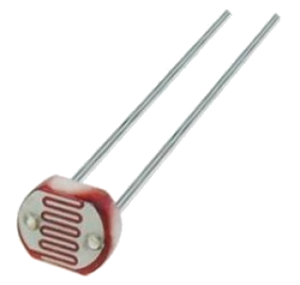

Tout symbole qui a des flèches dirigée vers le symbole, signifie qu'il change quand la lumière agit dessus.

Son symbole est:

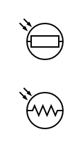

Plus d'infos sur les photorésistances ici: [Les photorésistances](../Electronique/photoresistances.md)

# Les thermistances

Ce sont des résistances qui font varier leur valeur en fonction de la température qu'ils atteignent.
Une thermistance est un composant électronique dont la résistance électrique varie en fonction de la température. C'est l'un des principaux capteurs de température utilisés en électronique.

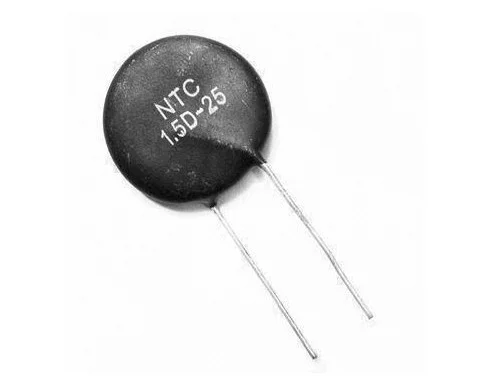

Les thermistances existent en 2 types, CTN (coefficient de température négative) et CTP (coefficient de température positive).

CTN : Augmente la valeur de votre résistance en abaissant la température (négative).

CTP : Augmente la valeur de votre résistance en augmentant la température (positive). 

Les symboles sont les suivants: 

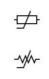

# Les varistances

La varistance est une résistance électrique permettant d'agir comme un parafoudre dans une installation. Son rôle est donc capital car il doit pouvoir empêcher une telle déferlante d'énergie d'endommager un système. Il est habituellement utilisé pour protéger les composants d'un circuit de surtension. Toute énergie de surtension potentiellement destructrice est dissipée sous forme de chaleur.
Le terme vient de l'anglais varistor, contraction de variable resistor. Une autre appellation anglaise est VDR (Voltage Dependent Resistor).

## Types de varistance
### Varistances à oxyde métallique

Les varistances à oxyde métallique (MOV) sont généralement fabriquées à partir d'oxyde de zinc combiné à de petites quantités d'autres oxydes métalliques, tels que le cobalt, le manganèse ou le bismuth. Ces matériaux sont frittés dans des boîtiers en céramique pendant la fabrication. Bien que les MOV soient disponibles en différents formats, les disques à plomb radiaux sont les plus couramment utilisés.

Applications :

- Suppression de la foudre et d'autres niveaux élevés d'énergie transitoire
- Alimentations basse tension dans les circuits c.c.
- Alimentation basse tension dans les applications automobiles
- Protection contre les courants transitoires internes dans les décharges de condensateur, la commutation de relais et la commutation de charge inductive

### Tension transitoire en céramique

Les suppresseurs de tension transitoire en céramique sont un type de résistance variable conçu pour répondre aux conditions momentanées de surtension. Ils sont plus efficaces que les autres types de composants de protection contre les surtensions, tels que les varistances ou les tubes de décharge de gaz, car ils répondent plus rapidement aux conditions changeantes. Ce type particulier de suppresseur de tension transitoire est fabriqué en céramique.

Applications :

Les suppresseurs de tension transitoire en céramique sont utilisés dans les circuits électroniques pour protéger les données ou les baluns. Ils sont destinés à assurer la protection contre les décharges électrostatiques unidirectionnelles et bidirectionnelles. Ce type de pic de tension soudain peut être causé en interne ou en externe, par exemple, par la foudre ou un arc électrique de moteur.

Plus d'infos sur les varistances ici: [Les varistances](../Electronique/varistances.md)

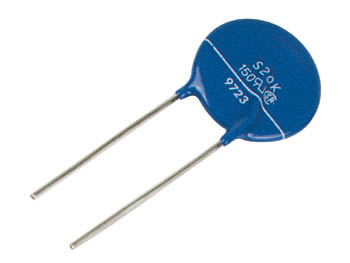

Le symbole de la varistance est:

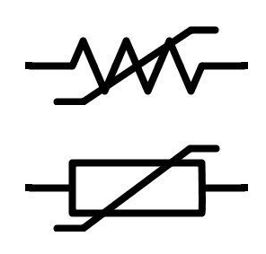

# Les diodes

La diode est un composant électronique permettant le passage du courant électrique dans un seul sens (polarisation directe). Elle permet au courant de circuler facilement dans une direction, mais restreint fortement le courant de circuler dans la direction opposée.

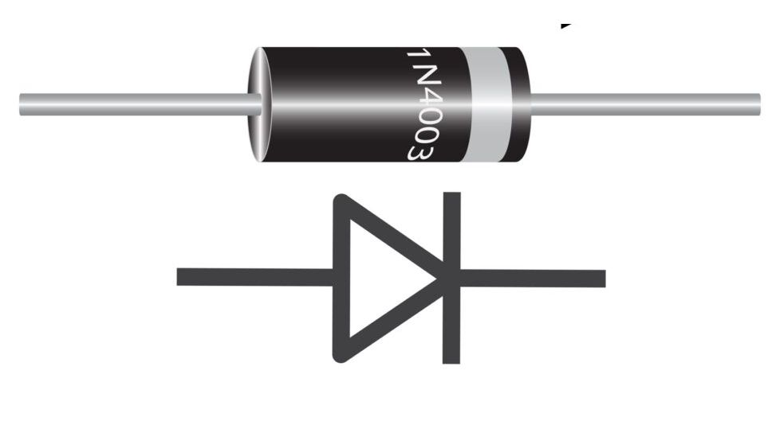

Les diodes sont également connues sous le nom de redresseurs car elles changent le courant alternatif (AC) en courant direct à pulsation (DC). Les diodes sont classées selon leur type, leur tension et leur capacité de courant.

Les diodes ont une polarité déterminée par une anode (fil positif) et une cathode (fil négatif). La plupart des diodes permettent au courant de circuler uniquement lorsqu'une tension positive est appliquée à l'anode.

Lorsqu'une diode permet au courant de circuler, elle est polarisée dans le sens direct. Lorsqu'une diode est en polarisation inverse, elle agit comme isolant et empêche le courant de circuler.

Le symbole diode est le suivant: 

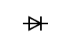

Plus d'infos sur les diodes ici: [Les diodes](../Electronique/diodes.md)

# Les LED

Une diode électroluminescente (abrégé en DEL en français, ou LED, de l'anglais : light-emitting diode) est un dispositif opto-électronique fait de matériau semi-conducteur, capable d'émettre de la lumière lorsqu'il est parcouru par un courant électrique. Une diode électroluminescente ne laisse passer le courant électrique que dans un seul sens et produit un rayonnement monochromatique ou polychromatique non cohérent par conversion d'énergie électrique lorsqu'un courant la traverse.

Une LED se comporte électriquement comme une diode. Pour émettre elle doit être polarisée en direct.

Le symbole de la LED est le suivant:

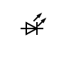

Pour plus d'infos sur les LED:  [Les led](../Electronique/led.md)

# Les diodes Zener

La diode Zener délivre une tension stable lorsqu’elle est polarisée en inverse. Cette tension correspond à sa tension Zener (Vz).

La diode Zener est un composant électrique dont les propriétés sont semblables à une diode conventionnelle, à la différence que la diode Zener laisse passer le courant inverse lorsque celui-ci dépasse le seuil de l'effet d'avalanche.

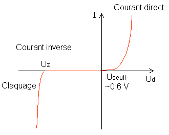

La diode Zener est facilement reconnaissable sur un schéma électrique car le symbole est similaire à une diode, à la différence du côté de la cathode qui ressemble à un Z inversé. Le côté de l'anode est identique à celui du symbole d'une diode conventionnelle.

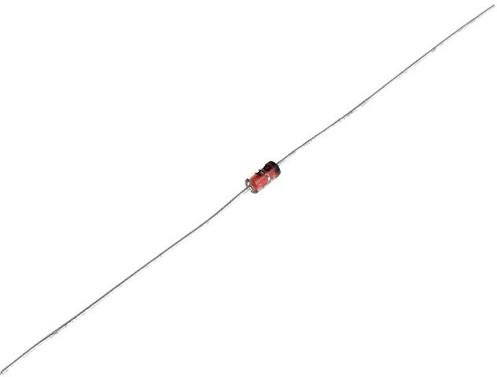

Le symbole de la diode zener est le suivant:

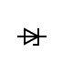

[zener](https://www.youtube.com/watch?v=WExtYZucIFc)

https://fr.rs-online.com/web/content/blog-discovery/conception-electronique/diode-commutation-diode-zener

Plus d'info ici: [Diode Zener](../Electronique/zener.md)

# Les condensateurs

Composant qui stocke une charge électrique, pour la libérer plus tard.

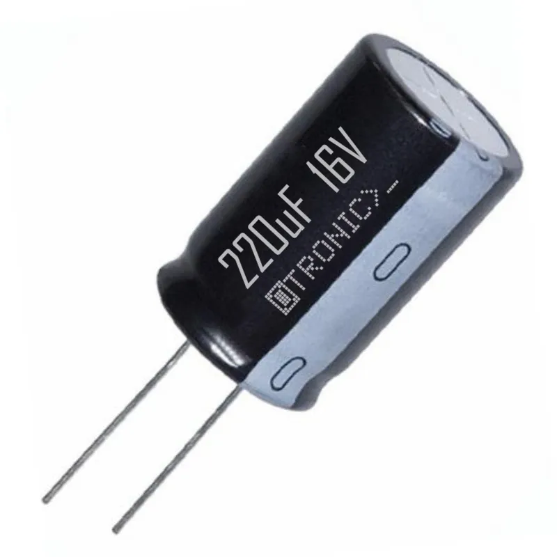

Un condensateur est un dispositif électrique qui stocke la charge électrique, comme une batterie. Cependant, la principale différence réside dans la manière dont ils stockent l’énergie. Bien qu’un condensateur ne puisse pas stocker autant d’énergie que ce dernier, il est capable de charger et de libérer de l’énergie beaucoup plus rapidement. Ces propriétés font des condensateurs des dispositifs extrêmement utiles pour toutes sortes d’applications électriques. 

La quantité de charge qu'il stocke est mesurée en Farad (F).

Attention: Les condensateurs électrolytiques sont constitués d'une composition chimique corrosive, et ils doivent toujours être connectés à la polarité correcte, patte longue au positif de la batterie ou de la batterie. 

Le symbole du condensateur:

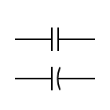

Plus d'info ici: [Les condensateurs](../Electronique/condensteur.md)

# Les relais

C'est un élément qui fonctionne comme un interrupteur actionné électriquement.
Il comporte deux circuits distincts. Un circuit d'une bobine qui, lorsqu'elle est activée par un courant électrique, change l'état des contacts. 

Les contacts activeront ou désactiveront un autre circuit différent du circuit d'activation de la bobine. 

Le symbole du relais:

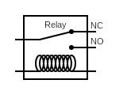

Lorsque le courant rentre dans le circuit de la bobine, l'interrupteur qui était ouvert se ferme et laisse donc passer la courant dans l'autre circuit

Plus d'info ici: [Les relais](../Electronique/relais.md)

# Les optocoupleurs

Un photocoupleur, ou optocoupleur, est un composant électronique capable de transmettre un signal d'un circuit électrique à un autre, sans qu'il y ait de contact galvanique entre eux.

Le terme de photocoupleur est traduit de l'anglais optocoupler ou optoisolator2 

# Diviseur de tension

Le diviseur de tension est un montage électronique simple qui permet de diminuer une tension d'entrée, constitué par exemple de deux résistances en série. Il est couramment utilisé pour créer une tension de référence ou comme un atténuateur de signal à basse fréquence. 

# Les transistors

https://www.areatecnologia.com/TUTORIALES/ELECTRONICA%20BASICA.htm

