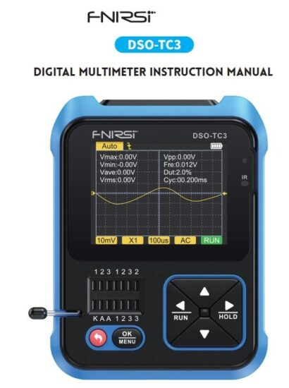

# Manuel d'instructions du multimètre numérique FNIRSI DSO-TC3

## AVIS À L'UTILISATEUR

- Ce manuel présente la méthode d'utilisation, les précautions et les questions connexes du produit. Lors de l'utilisation de ce produit, veuillez lire attentivement le manuel afin d'obtenir les meilleures performances du produit.
- Ne pas utiliser l'instrument dans un environnement inflammable et explosif.
- Les piles usagées ne peuvent pas être jetées avec les ordures ménagères. Veuillez suivre les lois et réglementations nationales ou locales en vigueur pour y faire face.
- S'il y a un problème de qualité avec l'instrument ou si vous avez des questions sur son utilisation, vous pouvez contacter le service client en ligne FNIRSI ou le fabricant, nous le résoudrons rapidement pour vous.

## INTRODUCTION

Ce produit combine un oscilloscope numérique, un testeur de composants électroniques, un générateur de signal, un test de continuité, de voltage, la mesure de la température et de l'humidité, le décodage infrarouge et d'autres fonctions sont habilement intégrés. Il est équipé d'un écran TFT couleur de grande taille, d'une batterie au lithium rechargeable intégrée, offre aux utilisateurs des fonctions plus solides et plus pratiques avec une bonne portabilité.

## SPÉCIFICATIONS TECHNIQUES

### Spécifications et paramètres de l'appareil

### Spécifications et paramètres de l'oscilloscope numérique DSO

- L'oscilloscope a un temps réel sampdébit de 10MSa/s et une bande passante de 500KHz.
- Avec fonction de déclenchement complète (simple, normal, automatique), peu importe si vous utilisez des signaux analogiques périodiques ou des signaux numériques non périodiques.
- Volume maximal mesurétagLe signal est de 400V.
- Équipé d'un AUTO efficace, la forme d'onde mesurée peut être affichée sans ajustements fastidieux.

### Spécifications et paramètres du mode de test des composants TC3

- L'instrument peut identifier et mesurer automatiquement divers transistors, y compris les triodes NPN et PNP, les mosfet à canal N et à canal P, les mosfet à jonction, les diodes, les diodes doubles, les thyristors et les résistances, les inductances, les condensateurs et autres composants passifs.
- Détection automatique de la définition des broches.
- Analysez automatiquement le code infrarouge du protocole NEC.
- Autres modes fonctionnels : y compris le test de continuité du circuit, le vol d'entrée 0 ~ 40 Vtage mesure, sortie PWM, mesure de diode régulée 0 ~ 32V, mesure du capteur de température DS18B20, mesure du capteur de température et d'humidité DHT11, etc.

**REMARQUE**

- Ices, Iceo, Uf ne sont affichés que lorsqu'ils sont valides.
- La capacité de jonction et le courant de fuite inverse ne sont affichés que lorsqu'ils sont valides.
- Le vol d'allumage ou d'extinctiontage du FET doit être inférieur à 5V.
- Affiché uniquement lorsqu'il y a une protection de diode.
- Vloss n'est affiché que lorsqu'il est valide.
- Composants à deux pattes et mesurez l'inductance lorsque la résistance est inférieure à 2.1 k.

### Spécifications et paramètres du générateur de signal

Le générateur de signal a un total de 6 formes d'onde à choisir, avec une fréquence réglable et amplatitude.

## ANALYSE DE L'INTERFACE CLÉ

### Bouton

### Prise d'essai

- Un total de cinq prises de test différentes sont divisées en zone 1-2-3 et zone KAA pour la commodité de la description (comme illustré ci-dessus).
- La prise de test se trouve en bas à gauche de l'écran, c'est une prise double rangée 14 trous avec un dispositif de verrouillage, et chaque prise est marquée 1, 2, 3, K, A, celles avec la même étiquette sont courtes- circuité en interne, et ont la même fonction.
- Il y a un petit levier à l'extrémité gauche de la douille. En position debout, la prise est détendue. À ce moment, insérez ou sortez le composant à tester, tournez la prise est verrouillée et testée lorsqu'elle est abaissée.
- Après avoir inséré le composant testé et l'avoir verrouillé, appuyez sur pour tester, et le testeur identifiera automatiquement le nom de la broche du composant et le point de test où il se trouve sont affichés à l'écran.
- Lors du test de composants à 2 broches, vous pouvez insérer deux étiquettes différentes dans les trous de la zone 1-2-3, dans n'importe quel ordre.
- Lors du test de composants à 3 broches, vous pouvez insérer trois étiquettes différentes dans les trous de la zone 1-2-3, dans n'importe quel ordre.
- La prise KAA est une zone spéciale pour résister voltage testing, qui contient un DC high voltage d'environ 30V ou plus, K est positif et A est négatif, et est utilisé pour résister voltage test de pression, ne pas mélanger. Insérez l'anode du composant testé, comme une diode Zener, dans A et la cathode dans K.

**⚠ Avis**

- Déchargez le condensateur avant de mesurer la capacité, sinon cela pourrait griller l'instrument.
- Il n'est pas recommandé de tester en ligne ou en direct.

### Interface des signaux

Trois prises coaxiales MCX sont uniformément réparties sur la surface supérieure, et leurs bagues extérieures sont connectées ensemble pour une masse commune, et elles sont utilisées à des fins différentes : IN (0~40V)-Test voltage port d'entrée, le fil central est positif, le vol maximal mesurétage ne peut pas dépasser DC40V. Port de sortie de signal du générateur DDS-Signal, sortie cinq signaux de forme d'onde avec largeur d'impulsion réglable. Port d'entrée du signal de test DSO-Oscilloscope, le vol d'entrée maximumtage ne peut pas dépasser 40Vpk.

**⚠ Avis**

Lors du test de la connexion, utilisez la ligne de test avec prise MCX pour vous connecter à l'instrument.

### Interface de charge

- L'instrument est alimenté par une batterie au lithium intégrée de grande capacité et la surface inférieure est équipée d'un port de charge USB Type-C connecté à un chargeur 5V.
- Le voyant est toujours rouge lors de la charge et le voyant est vert lorsqu'il est complètement chargé.

## FONCTIONNEMENT et DESCRIPTION

### Allumer et éteindre

### Fonctionnement et description des fonctions du testeur de transistor

Instructions d'utilisation du banc d'essai 1-2-3 zones
Sélectionnez une position appropriée dans cette zone et des prises avec des étiquettes différentes, et connectez des transistors, des résistances, des condensateurs, des inductances, etc. Une fois les broches des composants insérées et verrouillées, cliquez pour démarrer le test, attendez quelques secondes, le résultat s'affichera à l'écran.

- Les transistors bipolaires internes des diodes de protection et des MOSFET peuvent être détectés et affichés à l'écran.
- Mesurer le courant ampfacteur de lification (hFE) du transistor bipolaire et du vol conducteurtage de la jonction d'émetteur. Les transistors Darlington peuvent être identifiés par le vol de seuil élevétage et courant fort ampfacteur de lification.
- Triode de mesure, ses paramètres ne seront affichés que lorsque la mesure est valide.
- La capacité équivalente C et le courant de fuite inverse de la diode ne seront affichés que lorsque la mesure est valide.
- Le vol d'allumage ou d'extinctiontage du mosfet doit être inférieur à 5V, sinon le résultat mesuré n'est que ses paramètres équivalents (diodes, condensateurs, etc.).
- Le vol d'allumagetage du thyristor doit être inférieur à 5V, de plus, le courant de déclenchement pour maintenir la conduction doit être inférieur à 6mA, sinon il ne peut pas être mesuré correctement.
- Le vLoss affiché lors de la mesure de la capacité signifie la perte et l'atténuation. Plus la valeur est élevée, plus les performances de capacité sont mauvaises. Pour les condensateurs inférieurs à 20pF, la règle d'or consiste à tester avec un condensateur de 20pF.
- La plage de mesure de l'inductance est de 10uH-1000mH. L'inductance n'est mesurée que lorsque la résistance est inférieure à 2.1k. Les bobines à noyau d'air et les inducteurs de puissance ne peuvent pas mesurer directement l'inductance. Il est recommandé d'essayer de connecter une électrode annulaire de couleur appropriée en série pour tester.
- Le courant de sortie de la prise de test est de 6MA, ce qui nécessite un SCR entraîné par un courant plus important.
- La LED est détectée comme une diode, et le vol avanttagLe taux de chute est supérieur à la valeur normale. Les LED doubles sont détectées comme des diodes doubles. Les leds clignoteront pendant la détection.

Instructions de prise de test KAA

Insérez le composant positif, tel que la diode régulée, en A et la cathode en K, verrouillez la prise et cliquez pour démarrer le test. La plage de mesure maximale de la diode régulée est de 24V.

### Utilisation et description des fonctions de l'oscilloscope

Sur la page d'accueil, appuyez brièvement sur les touches gauche et droite pour passer à la fonction oscilloscope, et appuyez brièvement sur la touche de confirmation pour accéder aux pages de l'oscilloscope affichées.

Les paramètres dans les coins inférieur et supérieur gauche de l'écran peuvent être sélectionnés en appuyant brièvement sur les touches gauche et droite, et en commutant un par un après la sélection de l'effet, et les touches haut et bas / , pour basculer ou ajuster ; appuyez brièvement sur la touche AUTO pour ajuster automatiquement la forme, et appuyez longuement sur la touche gauche pour basculer entre STOP et RUN.

- L'icône d'indicateur de mode de déclenchement est l'icône d'indicateur de front de déclenchement.
- Auto signifie déclenchement automatique, Single signifie déclenchement unique, Normal signifie déclenchement normal.
- La sensibilité verticale, indiquant le voltage représenté par une grande grille dans le sens vertical.
- L'icône de l'indicateur de mode 1X/10X doit rester cohérente avec le
- Réglage du commutateur 1X/10X sur la poignée de la sonde, si la sonde est 1X, l'oscilloscope doit également être réglé sur 1X, 1X mesure ± 40V voltage, 10X mesures ± 400V voltage.
- 100uS est la base de temps horizontale, c'est-à-dire la durée représentée par une grande grille dans le sens horizontal.
- AC/DC est l'icône indicatrice du mode de couplage d'entrée, AC signifie couplage AC et DC signifie couplage DC.
- RUN/STOP est l'icône de l'indicateur de fonctionnement/pause, RUN signifie fonctionnement, STOP signifie pause, appuyez longuement sur le bouton gauche pour basculer.

**Paramètres de mesure en temps réel**

Appuyez longuement sur le bouton droit pour afficher/masquer les 8 paramètres de mesure en temps réel affichés dans la partie supérieure de l'écran :

**Sonde d'oscilloscope**

- Insérez la sonde de l'oscilloscope avec la fiche MCX dans la prise [DSO] sur la surface supérieure, réglez d'abord l'engrenage d'atténuation sur la sonde et connectez la pince de masse de la sonde à la «terre de référence» du circuit testé.
- Connectez la pointe de la sonde ou le crochet au nœud mesuré du circuit et observez le voltagla forme d'onde du point mesuré sur l'écran.

**Avertissement**

- Le facteur d'atténuation de la sonde doit correspondre au voltage du signal mesuré, et le voltagLe signal dépassant la plage maximale ne peut pas être mesuré.
- Lors de la mesure de signaux dépassant le vol de sécuritétage, ne doit pas toucher les parties métalliques exposées de l'instrument pour éviter les chocs électriques.

### Fonctionnement et description des fonctions du générateur de signaux

### Boîte à outils

Sur la page d'accueil, appuyez brièvement sur les touches gauche et droite pour passer à la boîte à outils, et appuyez brièvement sur la touche de confirmation pour accéder à la page de la boîte à outils, comme indiqué sur la figure.

**Vous avez le choix entre 6 fonctions :**

- Test de continuité
- Voltaget tester
- Test de température numérique DS18B20
- Test de température et d'humidité DHT11
- Décodage infrarouge
- Calibrage automatique

Appuyez brièvement sur le haut et le bas / , après être passé à la fonction correspondante, il mesurera automatiquement.

- Test de continuité : utilisez les deux coins des prises 1, 2 et 3 de la prise de test pour effectuer des tests de résistance continus. Si le circuit est à faible résistance, il sera jugé comme "connecté" et un signal sonore retentira.
- Voltage détection : insérez la ligne de test MCX dans la prise supérieure [IN (0 ~ 40 V)] pour détecter le voltage entre les lignes de test.
- DS18B20 : suivez les invites à l'écran pour insérer le capteur de température dans la prise de test pour la mesure.
- DHT11 : suivez les invites à l'écran pour insérer le capteur de température et d'humidité dans la prise de test pour la mesure (ne connectez pas la troisième broche du DHT).
- Décodage infrarouge : lorsque le testeur est en cours de test, pointez la télécommande infrarouge sur la marque "IR" sur le panneau du testeur, appuyez sur le bouton de la télécommande, et l'instrument commencera automatiquement à recevoir des signaux infrarouges et à effectuer le traitement de décodage. Après un décodage réussi, le code utilisateur sera affiché et le code de données, et affichera la forme d'onde infrarouge correspondante. Si le décodage échoue ou ne peut pas être décodé, le code utilisateur et le code de données ne seront pas affichés. À ce stade, si vous êtes sur l'interface du testeur, vous ne pouvez pas accéder à l'interface de décodage infrarouge. Si vous êtes sur l'interface de décodage infrarouge, les informations du dernier décodage réussi seront toujours affichées.
- Étalonnage automatique : insérez le fil court à trois broches dans la prise 1-2-3 de la prise de test selon les invites, et l'étalonnage démarrera automatiquement. Après avoir déconnecté les fils courts conformément aux invites du processus d'étalonnage, attendez que la barre de progression atteigne 100 % pour terminer l'étalonnage dans le mode actuel de l'instrument, aucune autre opération n'est requise.

**⚠ Avis**
Le circuit externe doit être éteint, sinon l'instrument peut être endommagé.

## RÉGLAGE DES MENUS

## MISE À NIVEAU DU FIRMWARE

Ouvrez le logiciel de mise à niveau sur l'ordinateur hôte, connectez l'ordinateur et l'appareil avec un câble USB, puis tout en appuyant sur la touche ▼, appuyez sur la touche d'alimentation pour accéder à la page de mise à niveau. Enfin, sélectionnez la mise à niveau du micrologiciel correspondante sur la page de l'ordinateur hôte pour terminer la mise à niveau du micrologiciel.

## ANALYSE DES PROBLÈMES COMMUNS

**Q : Comment déterminer si la batterie est complètement chargée ?**

R : Une fois la batterie complètement chargée, l'indicateur de charge passe du rouge au vert.

**Q : Pourquoi la forme d'onde de test continue-t-elle de trembler d'un côté à l'autre et ne peut-elle pas être corrigée ?**

R : Le volume de déclenchementtage doit être ajusté, qui est la flèche jaune sur
la droite. En mode déclencheur, appuyez sur les touches haut et bas pour régler le vol de déclenchementtage. Après avoir ajusté la flèche de l'indicateur jaune entre le haut et le bas de la forme d'onde, la forme d'onde peut être déclenchée et fixée.

**Q: Pourquoi n'y a-t-il pas de forme d'onde lors de la mesure d'une batterie ou d'un autre vol DCtage?**

R : Le volume de la batterietagLe signal est un signal continu stable sans forme d'onde courbe. Ajustez la sensibilité verticale en mode de couplage DC, il y aura une forme d'onde en ligne droite décalée vers le haut ou vers le bas, s'il s'agit d'un couplage AC, peu importe comment vous l'ajustez, il n'y aura pas de forme d'onde.

**Q : Pourquoi la forme d'onde secteur 220 V mesurée n'est-elle pas une onde sinusoïdale standard avec distorsion ?**

R : Le réseau électrique est généralement pollué et contient davantage de composants harmoniques d'ordre élevé. Ces harmoniques se superposent, ainsi une sinusoïde déformée apparaîtra sur l'onde sinusoïdale, ce qui est un phénomène normal. Les formes d'onde générales du secteur sont toutes des distorsions, rien à voir avec l'oscilloscope lui-même.

**Q : Pourquoi les paramètres des diodes et des capacités sont-ils obtenus lors de la mesure des MOSFET et des IGBT ?**

R: parce que le vol d'allumage ou d'extinctiontage du MOSFET ou IGBT est supérieur à 5V (le vol d'alimentation maximumtage de la puce), le MOSFET ou l'IGBT ne peut pas être allumé ou éteint normalement, donc seuls ses paramètres équivalents peuvent être mesurés.

## PRÉCAUTIONS

- Après avoir reçu l'appareil, veuillez l'utiliser après qu'il soit complètement chargé.
- Lors de la mesure d'un volume élevétage, ne touchez aucune partie métallique de l'oscilloscope pour éviter le risque de choc électrique.
- Essayez de ne pas effectuer de vol élevétage test pendant la charge.
- Ne placez pas la machine dans un endroit instable ou où elle pourrait être soumise à de fortes vibrations.
- Ne placez pas la machine dans des endroits très humides, poussiéreux, exposés à la lumière directe du soleil, à l'extérieur ou à proximité de sources de chaleur.
- L'instrument est alimenté par une batterie au lithium rechargeable intégrée de 3.7 V, veuillez utiliser un adaptateur secteur lorsque vous l'utilisez pendant une longue période afin de prolonger la durée de vie de la batterie.
- Lorsqu'elle n'est pas utilisée pendant une longue période, la batterie doit être déchargée à 3.7 V avant le stockage, et elle doit être chargée et déchargée tous les trimestres.
- Veuillez utiliser le voltage dans la plage spécifiée dans le manuel de charge.
- Lorsque vous utilisez le mode oscilloscope, faites attention à la sélection de l'atténuation 1X/10X, l'atténuation de l'oscilloscope doit être identique à l'atténuation de la sonde.
- Lors de l'étalonnage, il est nécessaire de débrancher la sonde BNC ou de court-circuiter les pôles positif et négatif de la sonde.

https://fr.manuals.plus/fnirsi/dso-tc3-digital-multimeter-manual