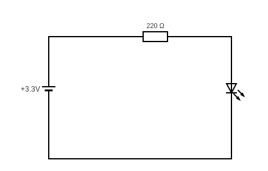
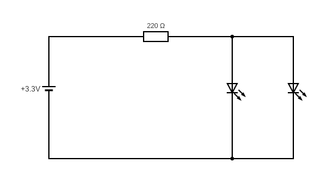

# Les circuits

## Circuits en série avec une résistance et une led

Aux bornes de la résistance, la tension est de: 0.7 V

Aux bornes de la led, la tension est de: 2.6 V

En série, chaque composant est traversé par le même courant et la somme des tensions aux bornes de chaques composants est égale à la tension fourni par la source.

Ici 2.6 + 0.7 =3.3 V

## Circuits en série avec une résistance et deux led

Aux bornes de la résistance, la tension est de: 0.8 V

Aux bornes de chaque led, la tension est de: 2.5  V

Dans un circuit en parallèle, la tension est la même aux bornes de chaque branche et le courant fourni est reparti entre les branches du circuit. Le courant total est la somme des courants traversant les différentes branches.

