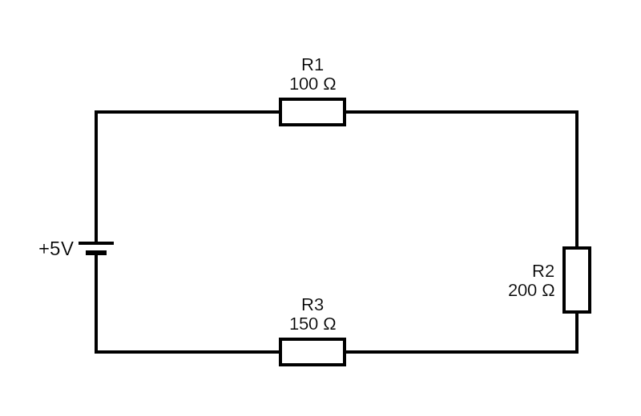

# Les basiques

## L'éléctricité

Qui fournit et recoit de l'éléctricité

Les générateurs fournissent l'éléctricité.
Les récepeteurs revoivent l'éléctricité.

Différence entre une pile et un accumulateur:

La pile électrique ou pile jetable, est un petit générateur portable d’énergie électrique qui transforme l’énergie d’une réaction chimique en énergie électrique. Contrairement aux batteries (ou accumulateurs), la pile est à usage unique et ne peut être rechargée.

Pile action chimique irréversible, non rechargeable
Accumulateur et batterie peuvent être rechargé.

Léléctricité se compose de charge éléctrique (positive et négative) qui fonctionne comme des aimanst des charges opposés s'attirent, des charges identiques se repoussent

C'est le principe du courant, c'est un déplacement ordonné de charge éléctrique qui se déplace dans un même sens et dans une même direction.

Ex: Une pile

La pile est composée de deux électrodes – un pôle positif (ou cathode) et un pôle négatif (ou anode) – plongées dans une solution faisant office de conducteur.

Lorsque ces électrodes sont reliées par un fil conducteur à un consommateur électrique, une ampoule par exemple, cela ferme le circuit. Il se crée alors un courant d’électrons ou courant électrique qui circule à travers le conducteur d’un pôle à l’autre de la pile.

Le fonctionnement d’une pile permet ainsi d’utiliser l’énergie d’une réaction chimique. Lorsque celle-ci cesse, la pile ne libère plus de courant, elle est donc déchargée et doit être remplacée.

Les charges négatives sont transportés pas des éléctrons.

On appelle intensité la quantité d'éléctrons se déplacant chaque seconde dans le circuit et elle se mesure en Ampère (A)

La tension génère le déplacement des éléctrons
La tension électrique est une grandeur physique qui représente la différence de potentiel électrique entre deux points d’un circuit. Elle se mesure en volts (symbole V) ou kilovolts (kV, 1kV = 1000V) et est souvent représentée par la lettre U.

Définitions de la tension électrique continue et de la tension électrique alternative:
On distingue classiquement deux types de tension électrique : la tension continue (notée DC pour Direct Current en anglais) et la tension alternative (AC ou Alternative Current).

La tension continue est constante dans le temps et ne change pas de polarité, c’est par exemple la tension délivrée par un générateur, comme une pile ou une batterie. La tension alternative varie constamment dans le temps et change de polarité. Dans nos foyers, la tension sur les prises domestiques est de 230 V (valeur dite “efficace”), il s’agit en fait d’un signal électrique sinusoïdal avec une fréquence de 50Hz (le signe de la tension change 100 fois par seconde), qui varie entre +325 volts et -325 volts.

## La loi d'ohm

### Qu'est que la résistance ?

La résistance éléctrique est la capacité à opposer une plus ou moins grande résistance à la circulation du courant éléctrique.

Les isolants ont une très grande résistance éléctrique. il'y aucun courant qui s'y forme. ex: platique, bois, verre.

Les conducteurs métallique ont une faible résistance et laisse passer le courant, ex: cuivre, argent, or.

Les semi-conducteurs sont un mix entre les deux: ils laissent passer le courant selon certaines conditions. 

Chaque matériau a sa propre résistance exprimé en ohm (Ω)

Plus la résistance est faible, mieux le courant passera. La résistance d'un matériau limite la vitesse de déplacement des éléctrons mesurée en Ampères.

La formule de la loi d'ohm est:

> U=R.I

U: tension en volt (V).
R: Résistance en ohm (Ω).
I: Intensité en Ampère (A).

Le symbole de la résistance est: 

#### Résistance en série

R1= 100Ω
R2= 200Ω
R3= 150Ω

Résistance équivalante
Req = R1 + R2 + R3 = 100 + 200 + 150 = 450Ω

> U=R.I <=> I=U/R

I = 5/450
I=0.0.111 soit 11mA

#### Résistance en parallèle

S'il n'y a que deux résistances

Resistance équivalent :

Req = R1 * R2 / (R1 + R2)
Req = 100 * 200 / (100 + 200)
Req = 66.6Ω

Si 2 résistances ou plus
Req = 1 / ((1/R1) + (1/R2) +(1/R3))

Req = 1 / ((1/100) + (1/200) +(1/150))
Req = 46.1Ω

#### Résistance en série et en parallèle

R1= 100Ω R3= 150Ω
R2= 200Ω R4= 300Ω

Req = R1 + ((R2 * R4)/(R2 + R4)) + R3

Req = 100 + ((200 * 300)/(200 + 300)) + 150
Req = 370Ω

## La loi des noeuds

La somme des courants entrant est égale à la somme des courants sortants

## La loi des mailles

La somme des tensions d'une maille doit être nulle

