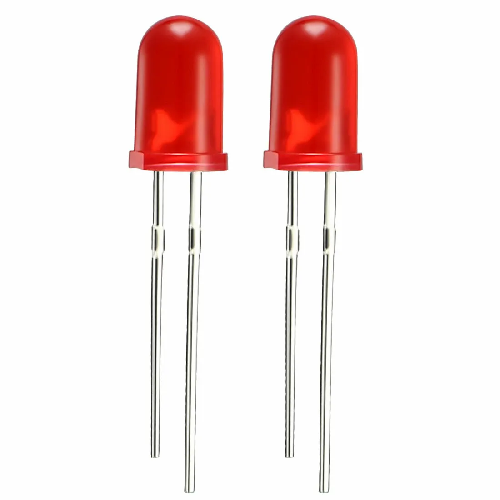
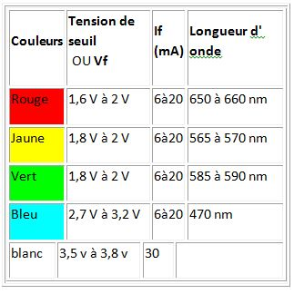
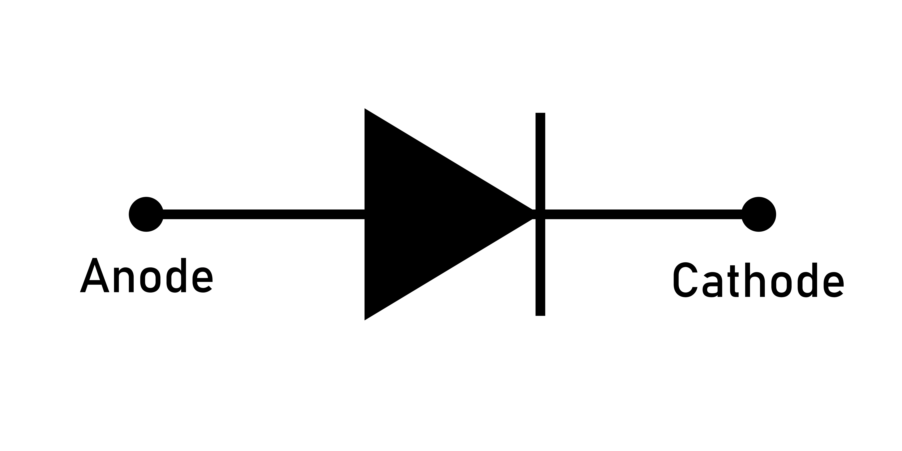

LED: Light Emitting Diode
DEL: Diode Electro Luminescente

Diode deux pattes: Dipôle

L'Anode(+) est la patte la plus longue
Cathode(-) la plus courte

La diode a un sens passant, du + au - et un sens bloquant du - au +

C'est un semi conducteur, il faut lui appliquer une tesion minimale (tension de seuil) pour que le courant passe et commence à émettre de la lumière.

Cette tension de seuil dépend de la LED mais surtout de la couleur.

Contrairement à une ampoule qui a beaucoup de déperdition, la led a un excellent rendement.

Il ne faut pas dépasser 20mA d'ou la nécessité de mettre une résistance.

Par exemple, si on prend une LED verte de 2V et de 20 mA
