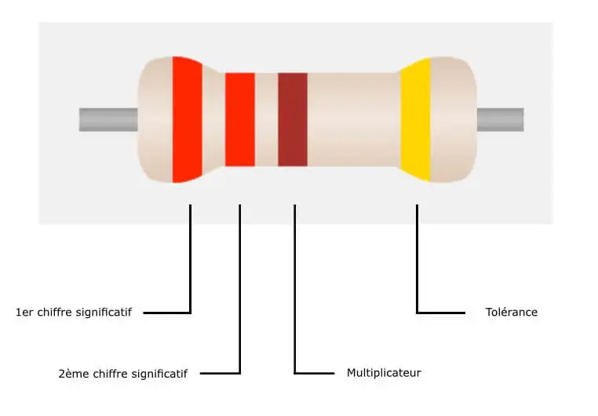
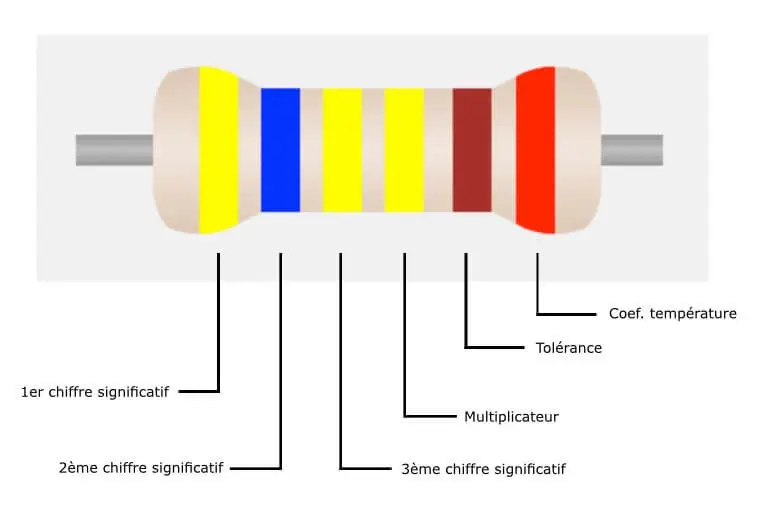

# Définition

La résistance est une mesure de l'opposition appliquée au courant dans un circuit électrique.

La résistance est mesurée en ohms, dont l'unité est symbolisée par la lettre grecque oméga (Ω). Cette unité se réfère au physicien allemand Georg Simon Ohm (1784-1854) qui a étudié la relation entre la tension, le courant et la résistance. Il a découvert la loi qui porte son nom, la loi d'Ohm.

# Calcul de la valeur

https://www.digikey.fr/fr/resources/conversion-calculators/conversion-calculator-resistor-color-code
https://www.ma-calculatrice.fr/calculer-valeur-resistance-couleur

Pour connaître la valeur en ohms d’une résistance, il faut observer le code des anneaux de couleurs. Cet outil convertit les différentes couleurs des anneaux de ce composant électrique en ohms qui est une valeur compréhensible par des humains.

## Les anneaux de couleurs de la résistance

Il existe plusieurs types de résistances avec 3, 4, 5 ou 6 anneaux (ou bagues) de couleur. Les couleurs ont une signification qui sera différente selon le nombre et le positionnement des anneaux.

### Résistances à 3 couleurs (anneaux)

Dans ce cas, la tolérance est de 20 %.

### Résistances à 4 couleurs (anneaux)

### Résistances à 5 couleurs (anneaux)

### Résistances à 6 couleurs (anneaux)

## Multiplicateur, Tolérance et Coefficient de température

### Définition du multiplicateur

Pour connaître la valeur en ohms, il faut convertir le code couleur des anneaux en chiffre pour ensuite le multiplier par le multiplicateur.

Exemple : Rouge (2), Noir(0), Rouge (x100) = 20 * 100 = 2000 ohms.

### Définition de la tolérance

La tolérance correspond à la précision de la valeur en ohms. Elle s’exprime en ohms et permet de connaître la valeur plancher et la valeur plafond.

### Définition du coefficient de température

Le coefficient de température s’exprime en ppm/°C et indique l’écart en ohms qu’il existe lorsque la température extérieure augmente ou diminue.

