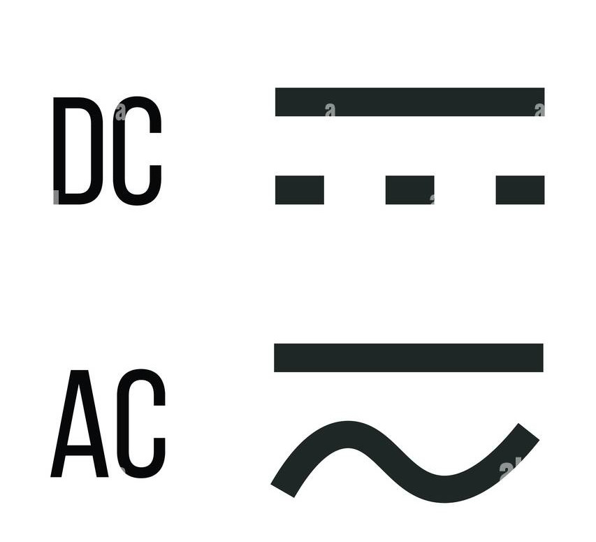

Un multimètre numérique est un outil de test qui sert à mesurer au moins trois valeurs électriques, principalement la tension (volt), le courant (ampère) et la résistance (ohm). Il s'agit d'un outil standard de diagnostic pour les techniciens des domaines de l'électricité et de l'électronique.

Les multimètres numériques combinent les capacités de test des multimètres à tâche unique : voltmètre (pour mesurer la tension), ampèremètre (pour mesurer le courant) et ohmmètre (pour mesurer la résistance). Ils comprennent souvent un nombre de fonctionnalités spécialisées supplémentaires ou d'options avancées. Les techniciens aux besoins spécifiques peuvent donc choisir un modèle ciblant des tâches particulières.

Les multimètres numériques comprennent généralement quatre composants :

- La zone d'affichage : là où les mesures sont affichées.
- Les boutons : pour sélectionner différentes fonctions. Les options varient d'un modèle à l'autre.
- Le bouton rotatif : pour sélectionner les principales valeurs de mesure (tension, courant, résistance).
- Les bornes d'entrées : là où les cordons de mesure sont insérés.

Les cordons de mesure sont des câbles flexibles et isolés (rouge = positif et noir = négatif) qui se connectent au multimètre numérique. Ils servent de conducteurs entre l'élément à l'essai et le multimètre. Les pointes de touche de chaque cordon servent à tester les circuits.

La résolution des multimètres numériques peut varier et définit le niveau de précision des mesures. En connaissant la résolution d'un multimètre, un technicien peut déterminer s'il est possible d'observer de petites variations du signal.

Par exemple, si le multimètre numérique a une résolution de 1 mV sur la plage de 4 V, vous pouvez observer un changement de 1 mV (1/1 000e de volt) lors d'un relevé de 1V.

Les multimètres numériques sont généralement classés par le nombre de points affichés (jusqu'à 20 000).

Attention, pour la mesure d'une tension ou d'une intensité, il ne faut pas comprendre le continu et l'alternatif.

## Mesurer la tension

Pour mesurer une tension, le câble noir sur le port COM et le rouge emplacement avec le V

Notion de portée

Ex: on veut prendre la tension d'une pile de 9V

Sur le multi, on prend le réperage 20V car on sait que c'est moins.

Sur un multimètre automqtique, on se met juste sur V

Quand on ne connait pas la tension, on prend la valeur la plus élévé du multimètre et on baisse jusqu'à obtenir un 1, cela signifie qu'on est allé trop loin, on retourne d'un cran pour avoir la bonne tension.

Les prises de courant ont un courant alternatif. Le courant alterne de direction en avancant et reculant. Le tilde est la representation du courant dans l'oscilloscope.

Toujours brancher le fil noir (neutre) en premier. Si on branche l'autre en premier, on aura du courant dans celui-ci.

## Mesurer l'intensité

On se postionne sur mA pour mesurer jusqu'à 200 mA max, soit A pour 10 A max (Selon le multimètre)

Si FUSED, le multimètre est protégé par un fusible

En Ampermètre, faible résistance donc on se met en série.

## Mesurer une résistance.

Elle doit être en dehors du circuit imprimé pour ne pas fausser le mesure.

Si on ne connait pas la valeur, on part de la plus haute à la plus basse.

