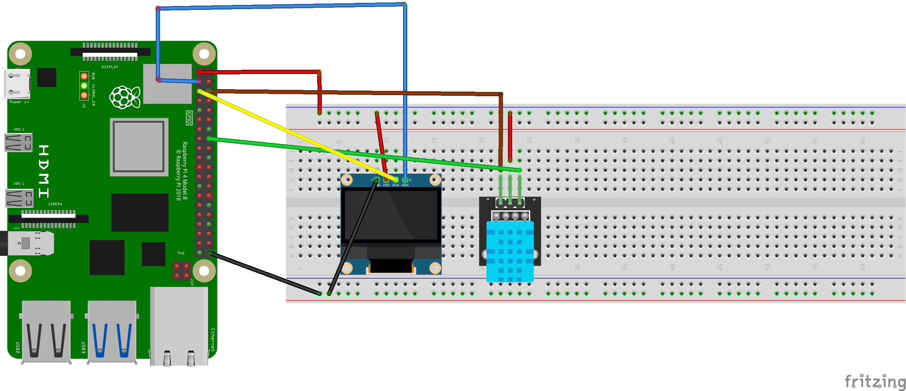

```python
#!/usr/bin/python

import Adafruit_DHT
from time import sleep
import os

import time
import Adafruit_GPIO.SPI as SPI
import Adafruit_SSD1306

from PIL import Image
from PIL import ImageDraw
from PIL import ImageFont

# Raspberry Pi pin configuration:
RST = 24
# Note the following are only used with SPI:
DC = 23
SPI_PORT = 0
SPI_DEVICE = 0

# Note you can change the I2C address by passing an i2c_address parameter like:
# disp = Adafruit_SSD1306.SSD1306_128_64(rst=RST, i2c_address=0x3C)
disp = Adafruit_SSD1306.SSD1306_128_64(rst=RST, i2c_address=0x3C)


# Initialize library.
disp.begin()

# Clear display.
disp.clear()
disp.display()

# Create blank image for drawing.
# Make sure to create image with mode '1' for 1-bit color.
width = disp.width
height = disp.height
image = Image.new('1', (width, height))

# Get drawing object to draw on image.
draw = ImageDraw.Draw(image)

# Draw a black filled box to clear the image.
draw.rectangle((0,0,width,height), outline=0, fill=0)

# Draw some shapes.
# First define some constants to allow easy resizing of shapes.
padding = 2
shape_width = 20
top = padding
bottom = height-padding
# Move left to right keeping track of the current x position for drawing shapes.
x = padding


# Load default font.
font = ImageFont.load_default()
font18 = ImageFont.truetype('Minecraftia.ttf', 18)
font20 = ImageFont.truetype('Minecraftia.ttf', 20)
font24 = ImageFont.truetype('Minecraftia.ttf', 24)

# Alternatively load a TTF font.  Make sure the .ttf font file is in the same directory as the python script!
# Some other nice fonts to try: http://www.dafont.com/bitmap.php
#font = ImageFont.truetype('Minecraftia.ttf', 8)

# Write two lines of text.
draw.text((x, top),    'Raspberry Pi',  font=font, fill=255)
draw.text((x, top+18), 'DHTxx', font=font24, fill=255)


# Display image.
disp.image(image)
disp.display()

# Sensor should be set to Adafruit_DHT.DHT11,
# Adafruit_DHT.DHT22, or Adafruit_DHT.AM2302.
sensor = Adafruit_DHT.DHT11

# Example using a Beaglebone Black with DHT sensor
# connected to pin P8_11.
pin = 23 

# Try to grab a sensor reading.  Use the read_retry method which will retry up
# to 15 times to get a sensor reading (waiting 2 seconds between each retry).


while True:
        humidity, temperature = Adafruit_DHT.read_retry(sensor, pin)
        if humidity is not None and temperature is not None:
                sleep(5)
                str_temp = ' {0:0.2f} *C '.format(temperature)
                str_hum  = ' {0:0.2f} %'.format(humidity)
                print('Temp={0:0.1f}*C  Humidity={1:0.1f}%'.format(temperature, humidity))
                draw.rectangle((0,0,width,height), outline=0, fill=0)
                #disp.clear()
                #disp.display()
                draw.text((3, top),    'Temperature/Humidity',  font=font, fill=255)
                draw.text((x, top+16), str_temp, font=font18, fill=255)
                draw.text((x, top+36), str_hum, font=font18, fill=255)
                disp.image(image)
                disp.display()
        else:
                print('Failed to get reading. Try again!')
                sleep(10)
```

```python
import time
import board
import adafruit_dht

# Initialisez le dispositif dht avec la broche de données connectée à la broche 16 (GPIO 23) du Raspberry Pi :
dhtDevice = adafruit_dht.DHT11(board.D23)

# Vous pouvez passer DHT22 use_pulseio=False si vous ne voulez pas utiliser pulseio.
# Cela peut être nécessaire sur un ordinateur monocarte Linux comme le Raspberry Pi,
# mais cela ne fonctionnera pas avec CircuitPython.
# dhtDevice = adafruit_dht.DHT22(board.D18, use_pulseio=False)

while True:
    try:
        # Imprimer les valeurs via l'interface série
        temperature_c = dhtDevice.temperature
        temperature_f = temperature_c * (9 / 5) + 32
        humidity = dhtDevice.humidity
        print("Temp: {:.1f} F / {:.1f} C    Humidity: {}% ".format(temperature_f, temperature_c, humidity))

    except RuntimeError as error:
        # Les erreurs sont assez fréquentes, les DHT sont difficiles à lire, passez à autre chose.
        print(error.args[0])
        time.sleep(2.0)
        continue
    except Exception as error:
        dhtDevice.exit()
        raise error

    time.sleep(5.0)
```