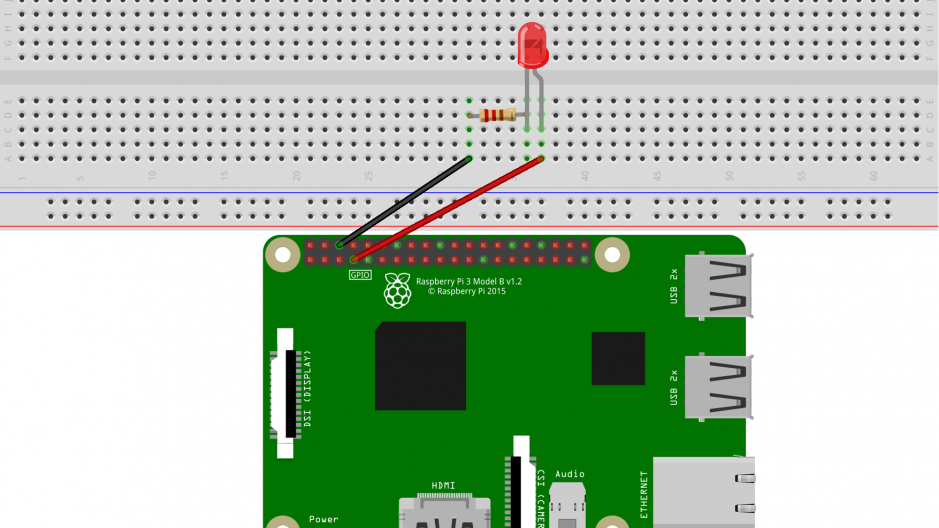

# Montage
## Materiel

- Breadboard pour le circuit
- résistance de 220 Ω
- LED

câble rouge: GPIO 7
câble noir: GPIO 6



# Code

```python
#!/usr/bin/env python3
#-- coding: utf-8 --

import RPi.GPIO as GPIO #Importe la bibliothèque pour contrôler les GPIOs

GPIO.setmode(GPIO.BOARD) #Définit le mode de numérotation (Board)
GPIO.setwarnings(False) #On désactive les messages d'alerte

LED = 7 #Définit le numéro du port GPIO qui alimente la led

GPIO.setup(LED, GPIO.OUT) #Active le contrôle du GPIO

state = GPIO.input(LED) #Lit l'état actuel du GPIO, vrai si allumé, faux si éteint

if state : #Si GPIO allumé
    GPIO.output(LED, GPIO.LOW) #On l’éteint
else : #Sinon
    GPIO.output(LED, GPIO.HIGH) #On l'allume
```

