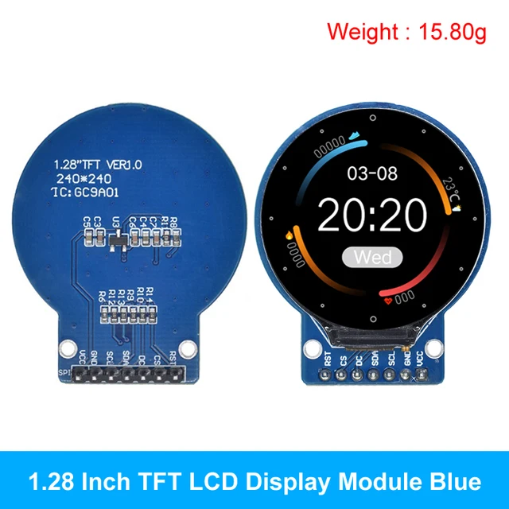

# Ecran LCD GC9A01

Acheté sur [Aliexpress](https://fr.aliexpress.com/item/1005006953748080.html?spm=a2g0o.order_list.order_list_main.49.11005e5b517IWg&gatewayAdapt=glo2fra)



On trouve plus aisement de la documentation pour la version de GC9A01 qui a 8 pin (1 de plus pour BL Back light)

Néanmoins, cela ne change pas grand chose, si  on ne tient pas compte de ce pin, on peut faire le branchement suivant:

<table>
    <thead>
        <tr>
            <td>LCD</td><td>USAGE</td><td>GPIO</td><td>Raspberry Pi physical pin</td>
        </tr>
    </thead>
    <tbody>
        <tr>
            <td>VCC</td><td>Alimentation</td><td>3.3V</td><td>1</td>
        </tr>
        <tr>
            <td>GND</td><td>Masse</td><td>GND</td><td>6</td>
        </tr>
        <tr>
            <td>SDA</td><td>Data</td><td>10 (spi0 MOSI)</td><td>19</td>
        </tr>
        <tr>
            <td>SCL</td><td>Clock</td><td>11 (spi0 SCLK)</td><td>23</td>
        </tr>
        <tr>
            <td>CS</td><td>Chip Select</td><td>8 (spi0 CE0)</td><td>24</td>
        </tr>
        <tr>
            <td>DC</td><td>Data/Command</td><td>25</td><td>22</td>
        </tr>
        <tr>
            <td>RST</td><td>Reset</td><td>27</td><td>13</td>
        </tr>
    </tbody>
</table>

Ensuite, il faut éditer le fichier /boot/firmware/config.txt et rajouter la ligne suivante à la toute fin de ce fichier:

```
dtoverlay=gc9a01
```

Normalement, il y a un fichier gc9a01.dtbo présent dans le dossier /boot/overlays

Si ce n'est pas le cas, il est disponible [ici](https://github.com/raspberrypi/firmware/raw/master/boot/overlays/gc9a01.dtbo)

Enfin, il ne reste qu'à démarrer le raspberry pi, on a la console qui s'affiche sur l'ecran lcd.

Si on souhaite afficher une image dans l'écran, on peut utiliser le programme suivant: [https://github.com/godspeed1989/fbv](https://github.com/godspeed1989/fbv)

Un pré-requis est l'installation des paquets suivants:

```bash
sudo apt install git libjpeg-dev libjpeg-png
```
Ensuite:

```bash
git clone https://github.com/godspeed1989/fbv.git
./configure
make
sudo make install
```

Ensuite, il suffit d'avoir une image bmp à disposition et on peut l'afficher sur l'écran avec la commande

```bash
fbv mon_image.bmp
```

Ce programme dispose de plusieurs options:

```bash
richard@esp32:~ $ fbv
Usage: fbv [options] image1 image2 image3 ...

Available options:
  -h, --help          Show this help
  -a, --alpha         Use the alpha channel (if applicable)
  -c, --dontclear     Do not clear the screen before and after displaying the image
  -u, --donthide      Do not hide the cursor before and after displaying the image
  -i, --noinfo        Supress image information
  -f, --shrink        Shrink (using a simple resizing routine) the image to fit onto screen if necessary
  -k, --colorshrink   Shrink (using a 'color average' resizing routine) the image to fit onto screen if necessary
  -e, --enlarge       Enlarge the image to fit the whole screen if necessary
  -l, --widthonly     Fit the image horizontally
  -t, --heightonly    Fit the image vertically
  -x <percent>, --smartfit <percent>  Show image by covering the whole screen if less than <percent>% is out of screen
  -r, --ignore-aspect Ignore the image aspect while resizing
  -s <delay>, --delay <d>  Slideshow, 'delay' is the slideshow delay in tenths of seconds.

  -n imagename(s)     Image name(s) shown in help
  -o <mode>, --orientation <mode>  Show image in specific orientation (0 = no rotation, 1 = 90° rotation, 2 = 180° rotation, 3 = 270° rotation)
  -y, --skiptty           Shows the image only once and skips tty input mode.
Input keys:
 r          : Redraw the image
 < or ,     : Previous image
 > or .     : Next image
 a, d, w, x : Pan the image
 f          : Toggle resizing on/off
 k          : Toggle resizing quality
 e          : Toggle enlarging on/off
 l          : Toggle fitting the image horizontally
 t          : Toggle fitting the image vertically
 i          : Toggle respecting the image aspect on/off
 +, -, 0    : Increase, decrease and reset zoom
 n          : Rotate the image 90 degrees left
 m          : Rotate the image 90 degrees right
 p          : Disable all transformations
 h          : Help and image information
 Copyright (C) 2000 - 2004 Mateusz Golicz, Tomasz Sterna.
 Copyright (C) 2013 yanlin, godspeed1989@gitbub
Error: Required argument missing.
```

## TIPS

### Effacer l'écran

cat /dev/zero > /dev/fb0

### Remplir avec des pixels

cp /dev/random /dev/fb0

### fbset

```bash
richard@esp32:~ $ fbset -fb /dev/fb0 

mode "240x240"
    geometry 240 240 240 240 16
    timings 0 0 0 0 0 0 0
    nonstd 1
    rgba 5/11,6/5,5/0,0/0
endmode
```

## Intéressant

https://medium.com/@avik.das/writing-gui-applications-on-the-raspberry-pi-without-a-desktop-environment-8f8f840d9867

