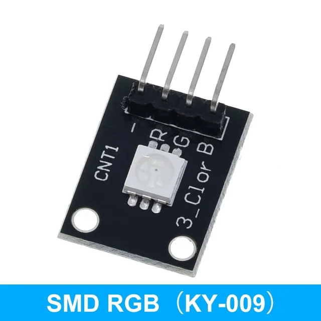
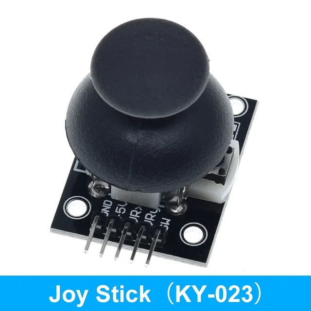

# KY-001

# KY-002

# KY-003

# KY-004

# KY-005

# KY-006

# KY-008

# KY-009

# KY-010

# KY-011

# KY-012

# KY-013

# KY-015

# KY-016

# KY-017

# KY-018

# KY-019

# KY-020

# KY-021

# KY-023

# KY-024

# KY-025

# KY-026

# KY-027

# KY-028

# KY-029

# KY-031

# KY-032

# KY-033

# KY-034

# KY-035

# KY-036

# KY-037

# KY-038

# KY-039

# HC-SR04

Le module à ultrasons HC-SR04 est un télémètre qui peut être utilisé pour mesurer la distance à un objet.

[1](https://raspberry-lab.fr/Composants/Mesure-de-distance-avec-HC-SR04-Raspberry-Francais/)
[2](https://www.gotronic.fr/pj2-guide-us-hc-sr04-raspberry-pi-2310.pdf)
[3](https://raspberrypi-tutorials.fr/utilisation-dun-capteur-de-distance-raspberry-pi-capteur-ultrasonique-hc-sr04/)

